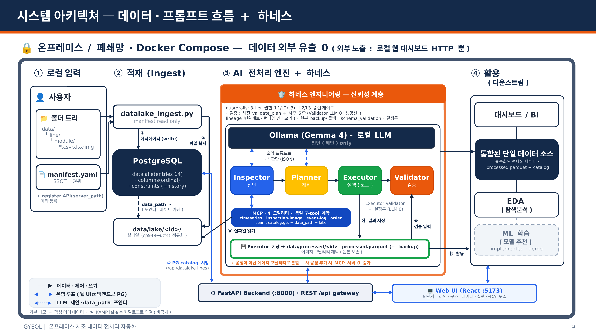

# GYEOL — Generative Yield Engine for On-prem LLM

**🌐 [English](README.md) · 한국어**

**MCP · 에이전트 · 로컬 LLM 기반으로, 제조 데이터 전처리를 폐쇄망 안에서 전부 자동화하는 시스템.**

> 기존 ETL은 사람이 변환 코드를 짠다.
> **GYEOL은 AI가 _계획_을 세우고, 결정론 코드가 _실행_하며, 사람이 _승인_한다.**

로컬 LLM이 데이터를 검사·계획하고, 결정론 엔진이 모든 변환·검증·학습을 수행하며, 사람이 게이트에서 권한 작업을 승인합니다. 모든 동작은 lineage로 추적되어 **IATF 16949 / 21 CFR Part 11** 감사 요건에 대응합니다.

```
Ollama (Gemma) → MCP (4 모달리티) → Inspector → Planner → [사람 승인] → Executor → Validator → Aggregator → EDA · ML
```

## 데모

*6단계 파이프라인 + 사람 승인 게이트, 폐쇄망에서 동작 (44초, 배속).*

https://github.com/user-attachments/assets/26b4d961-2cc3-43cb-b58c-220d3c8d9ceb

---

## 왜 만들었나

제조 데이터 전처리에는 세 가지 고질적 문제가 있습니다.

1. **수작업·느림** — 데이터셋마다 엔지니어가 정제/변환 코드를 직접 짠다.
2. **데이터가 공장 밖으로 못 나감** — 폐쇄망·데이터 주권 제약으로 외부 클라우드/LLM 도구를 못 쓴다.
3. **매번 재개발** — 새 공정이나 파일 포맷이 생길 때마다 처음부터 다시.

GYEOL은 **데이터를 외부로 한 번도 내보내지 않고** 이 작업을 자동화하며, 모든 변환을 **재현·감사 가능**하게 유지합니다.

---

## 핵심 설계 — 판단과 실행을 분리한다

핵심 신뢰성 결정: LLM은 비결정적이므로 **데이터를 직접 건드리지 않는다.**

| 역할 | 담당 | 이유 |
|---|---|---|
| 검사·계획·차트/모델 추천 | **로컬 LLM** (Gemma · Ollama) | 유연한 판단 — 제안(JSON)만 |
| 변환·검증·학습 | **결정론 엔진** (LLM 0) | 재현·감사 가능 — 데이터 경로에 LLM 0 |
| L2/L3 작업 승인 | **사람** | 리스크 기반 통제 |
| 모든 단계 추적 | **Lineage** | 감사·롤백 (IATF 16949 / 21 CFR Part 11) |

데이터 레이크는 **소리 없이 변형되지 않습니다**(anti-silent-drop): 원본은 보존되고, 카탈로그(`datalake.entries`)가 `datalake_id → data_path`를 매핑하며, 모든 작업은 전후 CSV와 롤백을 남깁니다.

---

## 무엇을 할 수 있나

GYEOL의 차별점은 개별 기능이 아니라, **"어떤 데이터가 와도"** 폐쇄망 안에서 자동 처리하고 추적한다는 데 있습니다.

- **데이터 무관 전처리** — 4개 모달리티(시계열·검사이미지·이벤트로그·주문)를 동일한 7-도구 계약으로 처리. 새 공정·새 포맷은 재개발이 아니라 계약 재사용으로 흡수.
- **AI 계획 + 결정론 실행** — LLM이 데이터를 검사하고 전처리 계획(이상치 제거 등)을 제안하면, 사람 승인 후 결정론 함수가 실행. 같은 입력 → 같은 출력(재현 가능), 원본 레이크는 무접촉(전후 CSV + 롤백).
- **전 구간 추적성** — 세션별 누적 lineage 뷰(작업·제거 행수·승인·시각)로 모든 변환을 감사·롤백.
- **폐쇄망 완결** — 외부 API 0. 데이터·추론·학습 전부 공장 내부에서. 외부 노출면은 웹 대시보드 HTTP뿐.
- **분석·모델링 보조** — 전처리된 데이터에 대해 차트 추천과 자연어 분석(승인 후 샌드박스 실행), scikit-learn / XGBoost 기반 모델 학습·결과 추적을 함께 제공.

---

## 아키텍처

전 구간이 **온프레미스 / 폐쇄망**(Docker Compose) 안에서 동작합니다. 외부로 노출되는 유일한 면은 웹 대시보드 HTTP뿐 — **데이터는 공장 밖으로 나가지 않습니다.**



**읽는 법:** LLM은 _제안_만 합니다(점선 `판단` 화살표) — 데이터를 직접 건드리지 않습니다. Inspector→Planner→Executor→Validator 체인은 결정론적으로 실행되며, 카탈로그 seam(`catalog.get → data_path → lake`)을 통해 데이터를 읽습니다. **하네스**가 엔진 전체를 감싸(3단계 권한 + 승인 게이트, 사전·사후 검증, lineage, 백업/롤백), 모든 작업이 감사·복구 가능합니다. 각 모달리티 서버는 동일한 **7-도구 계약**을 노출하므로, 새 공정은 재개발 대신 계약을 재사용합니다.

---

## 트러블슈팅 — 제한 스펙에서의 실용성 검증

GYEOL은 고사양 서버가 아니라 **공장 현장의 제한된 하드웨어**(예: RTX 3070, VRAM 8GB)에서 도입되는 것을 전제로 합니다. 실 KAMP 데이터로 로컬 LLM의 추론 비용을 측정하고, 병목을 추적해 최적화했습니다. (측정 코드·자료: `scripts/`)

**측정으로 확인한 것**

- **병목은 데이터가 아니라 LLM 추론** — 데이터를 1000배(184행 → 21만 행) 늘려도 처리 시간은 비례하지 않았습니다. 전처리(결정론)는 빠르고, LLM의 검사·계획 단계가 시간을 지배합니다.
- **모델 선택의 트레이드오프** — `e4b`(3.5GB)는 8GB VRAM에 완전 적재되어 ```10~25초```로 실용적이고, `26b`(19GB)는 8GB를 초과해 63%를 CPU로 오프로딩하며 125~175초로 느립니다.

**최적화 — 모델 콜드 로딩 제거**

- 첫 호출이 유독 느린 원인은 **모델 콜드 로딩**(디스크 → GPU 적재)이었습니다. `keep-alive` 워밍업으로 콜드 로딩을 제거하자 **`e4b`는 추론 시간이 평균 33% 단축**되었습니다.
- 반면 `26b`는 콜드 로딩을 제거해도(VRAM 변화 0) CPU 오프로딩 변동성이 지배해 안정화되지 않았습니다.

**결론** — 제한 스펙(8GB) 공장은 `e4b` + `keep-alive`로 즉시 도입 가능하며, `26b`는 24GB+ GPU를 전제로 합니다. 8GB의 한계는 *극복*이 아니라 *맞는 모델 선택 + 최적화*로 해결합니다.

---

## 기술 스택

| 계층 | 도구 |
|---|---|
| 백엔드 | FastAPI · PostgreSQL · Python |
| 에이전트 / LLM | MCP 서버(4 모달리티) · Ollama(로컬 Gemma) · Inspector / Planner / Executor / Validator / Aggregator |
| ML | scikit-learn · XGBoost |
| 프론트엔드 | React · Vite |
| 인프라 | Docker Compose · 온프레미스/폐쇄망 · NVIDIA Container Toolkit (GPU) |

---

## 빠른 시작 (리눅스 호스트)

전제: NVIDIA Container Toolkit + `docker run --gpus all` 동작 확인.

```bash
# 0) 더미 데이터 생성 (최초 1회 — git 미포함; 실데이터 레이크는 카탈로그로 별도 연결)
python3 data/synthetic/generate.py

# 1) 모델 선택 (.env)
cp .env.example .env       # 기본 gemma4:e4b

# 2) 백엔드 스택 기동 (ollama · postgres · MCP 4종 · backend)
docker compose up -d --build

# 3) Ollama 모델 받기 (최초 1회)
docker exec -it mfg-ollama ollama pull gemma4:e4b
#   필요 시: ollama pull gemma4:26b + .env의 OLLAMA_MODEL 교체

# 4) 프론트엔드 (compose 외 — 별도 기동, 기본 5173)
cd frontend && npm install && npm run dev
#   데이터 레이크 재설계 UI: VITE_DL_UI_V2=true npm run dev

# 5) 확인
#   백엔드 헬스체크:  curl http://localhost:8000/api/health
#   프론트엔드:       http://localhost:5173
```

> 추론 특성은 제한 스펙(RTX 3070, 8GB)에서 측정되었습니다 — `scripts/` 및 위 트러블슈팅 참조. `e4b`는 VRAM 내 완전 적재로 실용적이며, `26b`는 24GB+ GPU를 전제로 합니다.

---

## 파이프라인 — 6단계 (프론트엔드)

| # | 라우트 | 역할 |
|---|---|---|
| 1 | `/` | 라인(공정 흐름) 선택 |
| 2 | `/pipeline/build` | 파이프라인 구조 구성 (Stage별 function·역할) |
| 3 | `/pipeline/data` · `/pipeline/data-v2` | 데이터 선택 + 제약 입력 (`VITE_DL_UI_V2` 분기) |
| 4 | `/pipeline/run` | 실행·표준화 (승인 게이트) |
| 5 | `/pipeline/analyze` | EDA |
| 6 | `/pipeline/model` | 모델링 |

---

## 리포지토리 구조

| 경로 | 역할 |
|---|---|
| `docs/decisions.md` | 설계 결정 기록 (SSOT) |
| `mcp-servers/{timeseries,inspection-image,event-log,order}/` | 모달리티별 MCP 도구 (동일 7-도구 계약) |
| `agents/{inspector,planner,executor,validator,aggregator,eda,ml}/` | 에이전트 단계 |
| `harness/` | lineage · 가드레일 · 스키마 검증 · 컨텍스트 |
| `backend/` | FastAPI 오케스트레이션 + 엔드포인트 |
| `backend/catalog.py`, `backend/datalake_api.py` | 데이터 레이크 카탈로그 계층 · API |
| `frontend/` | React 6단계 파이프라인 (Vite) |
| `catalogs/` | 라인 · 모듈 · typical_ranges · 모델 풀 · `datalake_manifest.yaml` |
| `data/synthetic/` | 8가지 챌린지 더미 생성기 |
| `tools/` | 전후 CSV 내보내기 · 레이크 적재 · 백업 |
| `tests/` | pytest 스위트 (데이터 레이크 e2e 등) |
| `scripts/` | 제한 스펙 LLM 벤치마크 |

---

## 팀 & 기여

2인 팀 프로젝트.

- **송병갑 ([@sbg0700](https://github.com/sbg0700))** — 프로젝트 스켈레톤과 엔드투엔드 에이전틱 플로우 수직 골격 설계 · 트러블슈팅 리드 · React 6단계 파이프라인 UI 구축.
- **김명선 ([@myeongsun125](https://github.com/myeongsun125))** — 실제 제조 데이터(KAMP) 파이프라인 연결 · 이종 데이터 소스 매핑 · 메타데이터 카탈로그 생성.

스펙 기반(spec-driven) 개발: 모든 설계 결정은 구현 전 `docs/decisions.md`에 단일 진실 소스로 기록.
