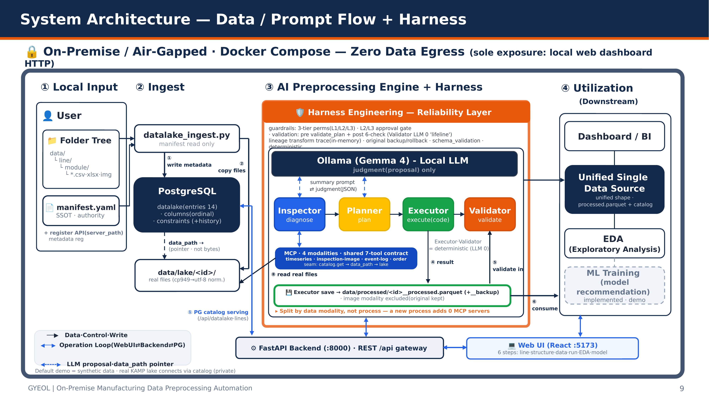

# GYEOL — Generative Yield Engine for On-prem LLM

**🌐 English · [한국어](README.ko.md)**

**An MCP · agent · local-LLM system that automates manufacturing data preprocessing entirely inside an air-gapped network.**

> Traditional ETL: a human writes the transformation code.
> **GYEOL: the AI writes the _plan_, deterministic code _executes_ it, and a human _approves_.**

A local LLM inspects and plans the work; a deterministic engine performs every transformation, validation, and training step; a human approves privileged operations at a gate. Every action is lineage-tracked, mapping to **IATF 16949 / 21 CFR Part 11** audit requirements.

```
Ollama (Gemma) → MCP (4 modalities) → Inspector → Planner → [Human approval] → Executor → Validator → Aggregator → EDA · ML
```

## Demo

*6-stage pipeline with a human approval gate, running fully on-prem (44s, sped up).*

https://github.com/user-attachments/assets/26b4d961-2cc3-43cb-b58c-220d3c8d9ceb

---

## Why it exists

Manufacturing data preprocessing has three chronic problems:

1. **Manual & slow** — engineers hand-write cleaning/transform code for every dataset.
2. **Data can't leave the plant** — closed networks and data-sovereignty rules block external cloud / LLM tools.
3. **Re-engineered every time** — each new process or file format means starting over.

GYEOL automates the work **without sending data outside**, and keeps every transformation **reproducible and auditable**.

---

## Core design — judgment and execution are separated

The central reliability decision: an LLM is non-deterministic, so **it never touches the data directly**.

| Concern | Owner | Why |
|---|---|---|
| Inspect, plan, recommend charts/models | **Local LLM** (Gemma via Ollama) | Flexible judgment — proposals only (JSON) |
| Transform, validate, train | **Deterministic engine** (LLM-free) | Reproducible & auditable — 0 LLM in the data path |
| Approve L2 / L3 operations | **Human** | Risk-gated control |
| Track every step | **Lineage** | Audit & rollback (IATF 16949 / 21 CFR Part 11) |

The data lake is **never silently mutated** (anti-silent-drop): the original is preserved, a catalog (`datalake.entries`) maps `datalake_id → data_path`, and every operation produces before/after CSVs with rollback.

---

## What it does

GYEOL's edge is not any single feature but that it handles **whatever data arrives** — automatically, inside an air-gapped network, with full traceability.

- **Data-agnostic preprocessing** — four modalities (time-series, inspection-image, event-log, order) handled through one shared 7-tool contract. A new process or format is absorbed by reusing the contract, not by re-engineering.
- **AI plans, deterministic code executes** — the LLM inspects the data and proposes a preprocessing plan (outlier removal, etc.); after human approval, deterministic functions run it. Same input → same output (reproducible), with the original lake untouched (before/after CSVs + rollback).
- **End-to-end traceability** — a per-session cumulative lineage view (operations, rows removed, approvals, timestamps) makes every transformation auditable and reversible.
- **Air-gapped by design** — zero external API calls. Data, inference, and training all stay inside the plant; the only external surface is the web dashboard over HTTP.
- **Analysis & modeling assist** — on preprocessed data, GYEOL also offers chart recommendation and natural-language analysis (sandboxed after approval), plus scikit-learn / XGBoost model training with tracked results.

---

## Architecture

End-to-end inside an **on-premise / air-gapped network** (Docker Compose). The only external surface is the web dashboard over HTTP — **data never leaves the plant**.



**How to read it:** the LLM only *proposes* (dashed `judgment` arrows) — it never touches data. The Inspector→Planner→Executor→Validator chain runs deterministically, reading data through the catalog seam (`catalog.get → data_path → lake`). The **harness** spans the engine (3-tier guardrails + approval gate, pre/post validation, lineage, backup/rollback), so every operation is auditable and reversible. Each modality server exposes the same **7-tool contract**, so a new process reuses the contract instead of rebuilding.

---

## Troubleshooting — proving practicality on constrained hardware

GYEOL is meant to be deployed not on high-end servers but on the **limited hardware found on a factory floor** (e.g. an RTX 3070 with 8 GB VRAM). Using real KAMP data, we measured the local LLM's inference cost, traced the bottleneck, and optimized it. (Measurement code and assets: `scripts/`)

**What the measurements showed**

- **The bottleneck is LLM inference, not data** — scaling the data 1000× (184 → 210,000 rows) did not scale the processing time proportionally. The deterministic preprocessing is fast; the LLM's inspect/plan steps dominate the time.
- **A model-selection trade-off** — `e4b` (3.5 GB) fits fully in 8 GB VRAM and runs in 10–25 s, while `26b` (19 GB) exceeds 8 GB and offloads 63% to the CPU, running at 125–175 s.

**Optimization — removing model cold-loading**

- The first call was disproportionately slow because of **model cold-loading** (disk → GPU). Removing it with a `keep-alive` warm-up cut **`e4b`'s inference time by ~33% on average**.
- `26b`, by contrast, did not stabilize even with cold-loading removed (0 VRAM change): CPU-offloading variance dominates.

**Conclusion** — a constrained (8 GB) plant can deploy immediately with `e4b` + `keep-alive`, while `26b` assumes a 24 GB+ GPU. The 8 GB limit is solved not by *overcoming* it but by *choosing the right model + optimizing* it.

---

## Tech stack

| Layer | Tools |
|---|---|
| Backend | FastAPI · PostgreSQL · Python |
| Agents / LLM | MCP servers (4 modalities) · Ollama (local Gemma) · Inspector / Planner / Executor / Validator / Aggregator |
| ML | scikit-learn · XGBoost |
| Frontend | React · Vite |
| Infra | Docker Compose · on-premise / air-gapped · NVIDIA Container Toolkit (GPU) |

---

## Quick start (Linux host)

Prerequisite: NVIDIA Container Toolkit + verified `docker run --gpus all`.

```bash
# 0) Generate dummy data (first run only — not in git; real lake connects via catalog)
python3 data/synthetic/generate.py

# 1) Select model (.env)
cp .env.example .env       # default gemma4:e4b

# 2) Start the backend stack (ollama · postgres · 4 MCP servers · backend)
docker compose up -d --build

# 3) Pull the Ollama model (first run only)
docker exec -it mfg-ollama ollama pull gemma4:e4b
#   if needed: ollama pull gemma4:26b  + update OLLAMA_MODEL in .env

# 4) Frontend (outside compose — runs separately, default 5173)
cd frontend && npm install && npm run dev
#   data-lake redesign UI: VITE_DL_UI_V2=true npm run dev

# 5) Verify
#   backend health:  curl http://localhost:8000/api/health
#   frontend:        http://localhost:5173
```

> Inference characteristics were measured on constrained hardware (RTX 3070, 8 GB) — see `scripts/` and the Troubleshooting section above. `e4b` fits fully in VRAM and is practical; `26b` assumes a 24 GB+ GPU.

---

## Pipeline — 6 stages (frontend)

| # | Route | Role |
|---|---|---|
| 1 | `/` | Select line (process flow) |
| 2 | `/pipeline/build` | Compose pipeline structure (function / role per stage) |
| 3 | `/pipeline/data` · `/pipeline/data-v2` | Select data + enter constraints (`VITE_DL_UI_V2` toggle) |
| 4 | `/pipeline/run` | Execute & standardize (approval gate) |
| 5 | `/pipeline/analyze` | EDA |
| 6 | `/pipeline/model` | Modeling |

---

## Repository structure

| Path | Role |
|---|---|
| `docs/decisions.md` | Design decision records (SSOT) |
| `mcp-servers/{timeseries,inspection-image,event-log,order}/` | MCP tools per modality (shared 7-tool contract) |
| `agents/{inspector,planner,executor,validator,aggregator,eda,ml}/` | Agent stages |
| `harness/` | lineage · guardrails · schema validation · context |
| `backend/` | FastAPI orchestration + endpoints |
| `backend/catalog.py`, `backend/datalake_api.py` | Data-lake catalog layer & API |
| `frontend/` | React 6-stage pipeline (Vite) |
| `catalogs/` | lines · modules · typical_ranges · model pool · `datalake_manifest.yaml` |
| `data/synthetic/` | 8-challenge dummy generator |
| `tools/` | before/after CSV export · lake ingest · backup |
| `tests/` | pytest suite (data-lake e2e, etc.) |
| `scripts/` | constrained-hardware LLM benchmarks |

---

## Team & Contributions

2-person team project.

- **Byeonggab Song ([@sbg0700](https://github.com/sbg0700))** — designed the project skeleton and the end-to-end agentic-flow vertical backbone; led troubleshooting; built the React 6-stage pipeline UI.
- **Myeongsun Kim ([@myeongsun125](https://github.com/myeongsun125))** — connected the real manufacturing data (KAMP) pipeline; mapped heterogeneous data sources and generated the metadata catalog.

Built spec-driven: design decisions are recorded in `docs/decisions.md` as the single source of truth before implementation.
